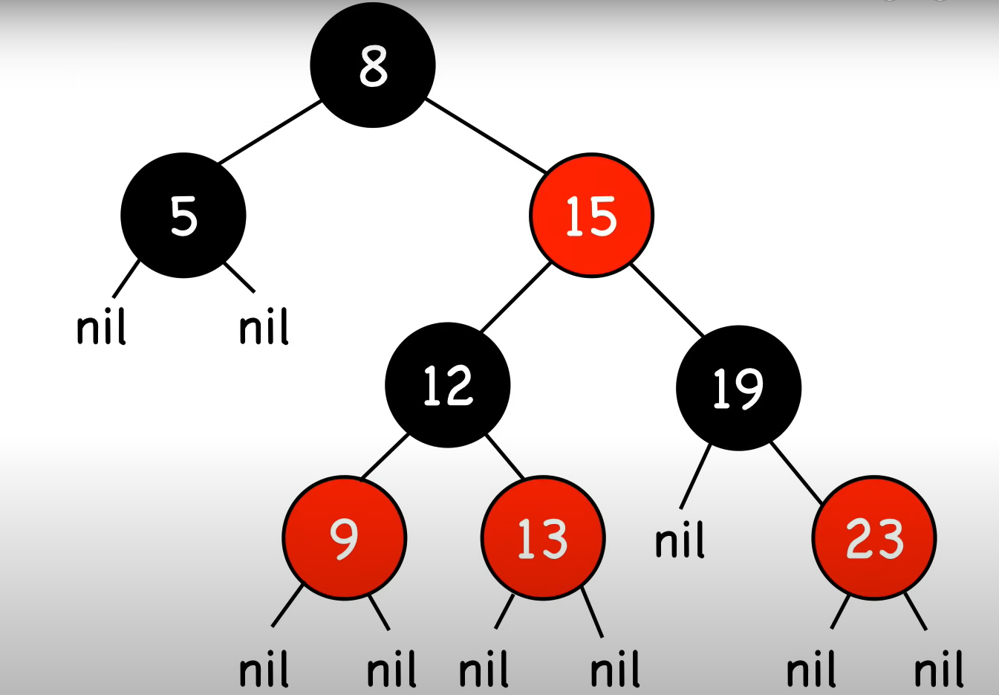

# Introduction

### Balanced Search Trees

- Guaranteed Height of `O(logn)` for n items
- Red-Black Tree is a specific type of Balanced Search Tree

## Properties
- A node is either red or black
- The root and leaves(NIL) are black
- If a node is red then its children are black
- All paths from its root to its NIL descendants contains the same number of black nodes

## Extra Notes
- Nodes require one storage bit to keep track of color.
- The longest path (Root to farthest NIL) is no more than twice the length of shortest path
- - Shortest Path: All black nodes
- - Longest path: Alternating Red and Black